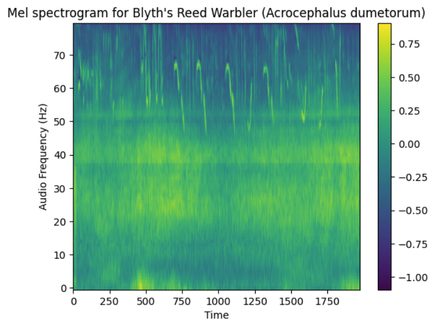

# MLX5 Week 7: Birdsong Species Classification with Whisper
# Birdsong Classification using Whisper Encoder

This project leverages OpenAI's Whisper encoder architecture to classify bird species from their songs. We adapt the powerful audio processing capabilities of Whisper, originally designed for speech recognition, to the unique challenges of birdsong classification.



## Overview

The system works by:
1. Converting audio recordings into mel spectrograms
2. Using Whisper's encoder to extract audio features
3. Classifying bird species through a custom classification head

## Technical Architecture

### Audio Processing Pipeline
1. **Audio Input** → **Mel Spectrogram Conversion**
   - Input: Raw audio files (.ogg, .wav, .mp3)
   - Output: Mel spectrogram matrix (n_mels × time_steps)
   - Parameters:
     - Sample rate: 16kHz
     - n_mels: 80
     - Window size: 25ms
     - Hop length: 10ms

2. **Feature Extraction**
   - Using Whisper's pre-trained encoder
   - Leverages Whisper's robust audio understanding capabilities
   - Outputs high-dimensional feature embeddings

3. **Classification**
   - Custom classification head
   - Current implementation: Single-species classification
   - Future work: Multi-species detection

## Current Capabilities

- Single species classification from isolated recordings
- Support for common North American bird species
- Real-time inference on standard hardware
- Integration with BirdCLEF 2024 dataset

## Future Directions

### Multi-species Classification
- Implementing multi-label classification
- Handling overlapping bird calls
- Temporal localization of different species

### Performance Improvements
- Fine-tuning Whisper encoder for bird-specific features
- Data augmentation techniques
- Model quantization for edge devices

## Dataset

We use the BirdCLEF 2024 dataset, which includes:
- High-quality bird recordings
- Species labels
- Temporal annotations
- Geographic metadata

## Usage

```python
# Example code for processing a single audio file
from model import WhisperBirdClassifier
from utils import audio_to_mel

# `Load model
model = WhisperBirdClassifier()

# Process audio
audio_path = "path/to/bird_recording.ogg"
mel_spectrogram = audio_to_mel(audio_path)
prediction = model(mel_spectrogram)
```

The main training pipeline is implemented in `notebooks/subsample.ipynb`. This notebook:
- Loads and preprocesses the BirdCLEF dataset
- Filters recordings to Great Britain region
- Trains a classifier using Whisper's encoder and a custom classification head
- Logs training metrics to Weights & Biases

## Dependencies

- PyTorch
- OpenAI Whisper
- GeoPandas
- Weights & Biases
- pandas
- matplotlib
- contextily


## Contributing

We welcome contributions! Areas we're particularly interested in:
1. Multi-species detection improvements
2. Data augmentation techniques
3. Model optimization
4. Additional species support

## Citation

If you use this project in your research, please cite:
```bibtex
@software{mlx-birdsong,
author = {John R Hoopes},
title = {Birdsong Classification using Whisper Encoder},
year = {2024},
url = {https://github.com/johnx25bd/mlx-birdsong}
}
```


## License

MIT License

## Acknowledgments

- [Barbora Filova](https://www.linkedin.com/in/barborafilova/)
- OpenAI Whisper team
- BirdCLEF dataset creators
- Contributing researchers and developers